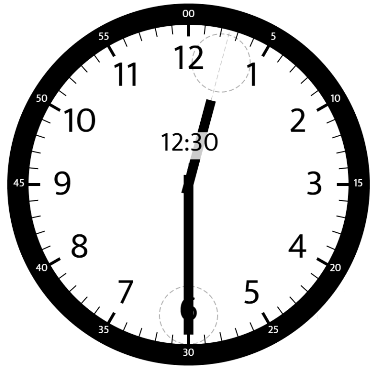
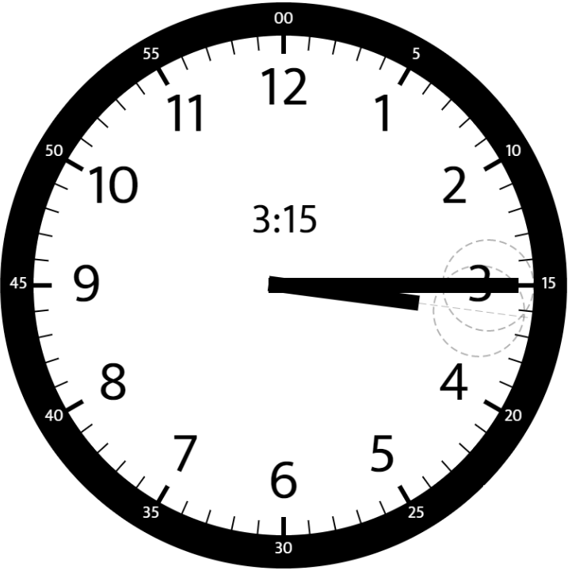

# Angle Between Hands of a Clock

[Question](https://leetcode.com/problems/angle-between-hands-of-a-clock/)

Given two numbers, hour and minutes. Return the smaller angle (in degrees) formed between the hour and the minute hand.

Example 1:



```
Input: hour = 12, minutes = 30
Output: 165
```

Example 2:


```
Input: hour = 3, minutes = 30
Output: 75
```

Example 3:



```
Input: hour = 3, minutes = 15
Output: 7.5
```

Example 4:

```
Input: hour = 4, minutes = 50
Output: 155
```

Example 5:

```
Input: hour = 12, minutes = 0
Output: 0
```

Constraints:  
1 <= hour <= 12  
0 <= minutes <= 59  
Answers within 10^-5 of the actual value will be accepted as correct.
